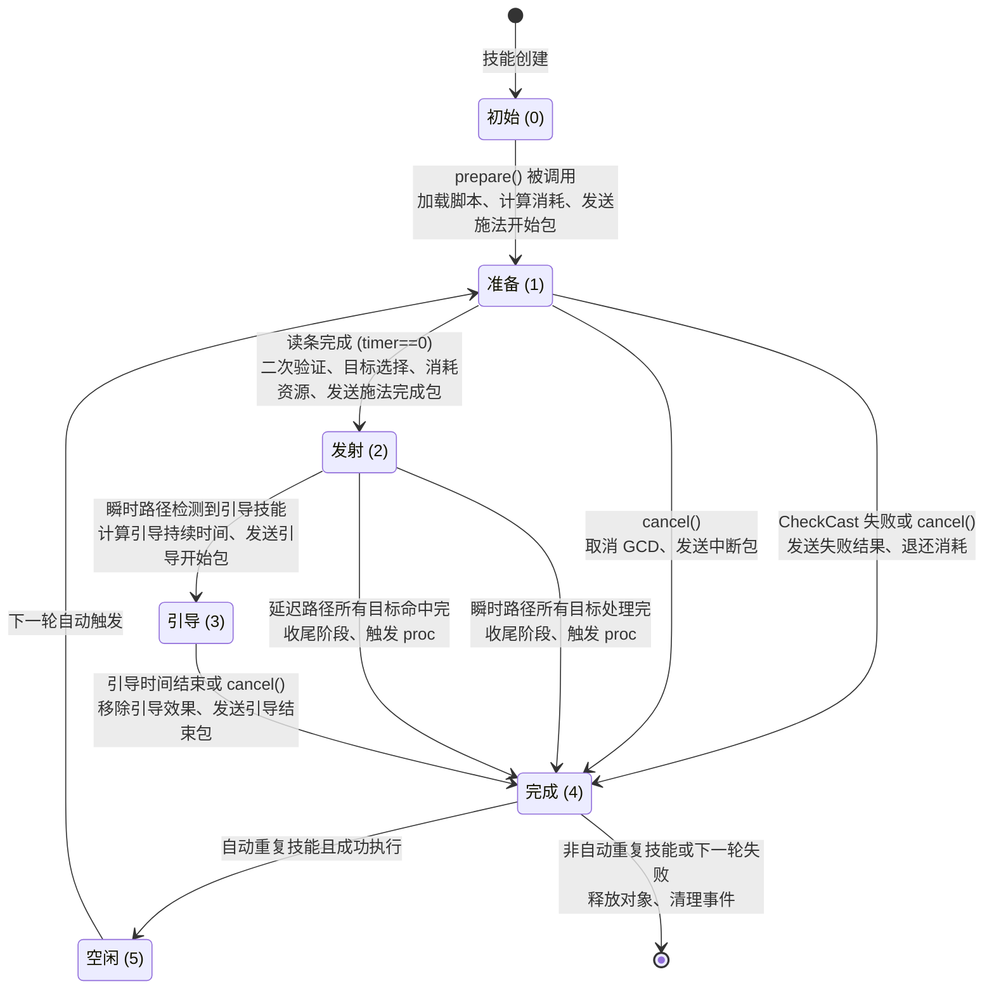

# MMO 施法状态机：完整设计

> 一份面向游戏服务端工程师的施法系统设计参考。本文基于对 TrinityCore（World of Warcraft 私有服务器）施法系统的深度分析，以纯概念方式描述其架构，使读者能够在自己的项目中复刻类似系统。

---

## 1 引言

### 1.1 施法系统是什么

在 MMO 游戏中，"施法"（Spell Cast）是玩家或 AI 对游戏世界产生影响的基本方式。当战士挥剑、法师发射火球、牧师治疗队友——这些动作在服务器端的统一抽象就是**施法**。

一个典型的施法事件涉及以下参与方：

```
┌─────────┐    ┌──────────┐    ┌──────────┐    ┌─────────┐
│  玩家   │───▶│  客户端   │───▶│  服务器  │───▶│  目标    │
│(发起者)  │    │(展示)    │    │(核心逻辑)│    │(承受者)  │
└─────────┘    └──────────┘    └──────────┘    └─────────┘
```

- **玩家**选择技能、指定目标，客户端发送施法请求
- **服务器**执行完整的施法验证、状态管理、效果计算、目标选择
- **目标**接收效果（伤害、治疗、光环施加等）

### 1.2 为什么需要状态机

施法过程不是瞬间完成的。一个火球术可能需要 3 秒读条，再经过 1 秒弹道飞行才命中。一个引导治疗需要持续 5 秒并周期性治疗。在这个过程中，玩家可能移动、被控制、甚至手动取消。

状态机（Finite State Machine）是管理这种**多阶段、可中断、有分支**流程的自然选择：

- 每个时刻，施法处于**唯一确定的状态**
- 状态之间的转移有**明确的触发条件**
- 中断和取消可以**统一处理**

替代方案——如行为树或事件驱动管线——在处理"可中断的多阶段流程"时远不如状态机清晰。

### 1.3 本文目标读者

- 希望在自己的游戏项目中实现类似施法系统的服务端工程师
- 需要理解 MMO 施法系统设计决策依据的架构师
- 对 TrinityCore 具体实现感兴趣但不打算阅读其源码的研究者

### 1.4 设计理念总览

本文描述的施法系统遵循以下核心设计理念：

| 理念 | 说明 |
|------|------|
| **数据驱动** | 技能的所有行为由静态数据定义（属性位标志），而非硬编码。新增技能通常不需要修改核心逻辑 |
| **两阶段效果** | 效果执行分为"发射"和"命中"两阶段，支持弹道类技能的延迟命中 |
| **维度分解** | 目标选择通过 5 个正交维度描述，替代嵌套条件分支 |
| **脚本可扩展** | 在施法生命周期的关键节点暴露钩子（Hook），允许在不修改核心代码的情况下自定义技能行为 |
| **四种目标容器** | Unit、GameObject、Item、Corpse 四种目标类型各自独立管理 |

---

## 2 状态定义

### 2.1 六个状态

施法对象（一次施法行为）从创建到销毁经历以下 6 个状态：

| 状态 | 数值 | 语义 | 类比 |
|------|------|------|------|
| 初始 | 0 | 对象刚创建，尚未开始任何处理 | 出生 |
| 准备 | 1 | 正在读条（施法时间倒计时中） | 蓄力中 |
| 发射 | 2 | 技能已施出，效果正在飞行/延迟命中中 | 子弹已出膛 |
| 引导 | 3 | 引导类技能正在持续执行（如持续治疗） | 持续引导中 |
| 完成 | 4 | 技能执行完毕，等待清理 | 结束 |
| 空闲 | 5 | 仅用于自动重复攻击技能，等待下一次触发 | 装弹等待 |

其中"空闲"状态是**特殊情况**——仅当技能被标记为"自动重复"（如自动射击）且成功执行后才会进入，使对象不被销毁，以便在下一轮自动触发时复用。

### 2.2 状态角色

从设计角度，这 6 个状态分为三类：

```
┌───────────────────────────────────────────────────────────┐
│                                                          │
│  瞬态状态：NULL → FINISHED                                │
│  （仅存在一瞬间，用于资源清理）                            │
│                                                          │
├───────────────────────────────────────────────────────────┤
│                                                          │
│  活跃状态：PREPARING → LAUNCHED → CHANNELING              │
│  （施法的核心生命周期）                                    │
│                                                          │
├───────────────────────────────────────────────────────────┤
│                                                          │
│  特殊状态：IDLE                                         │
│  （仅自动重复技能使用）                                   │
│                                                          │
└───────────────────────────────────────────────────────────┘
```

---

## 3 状态转移

### 3.1 完整状态图



### 3.2 状态转移表

| # | 源状态 | 目标状态 | 触发条件 | 主要副作用 |
|---|--------|----------|----------|-----------|
| 1 | 初始 | 准备 | prepare() 被调用 | 加载脚本、计算消耗、发送施法开始包 |
| 2 | 准备 | 完成 | CheckCast 失败或 cancel() | 发送失败结果、退还消耗 |
| 3 | 准备 | 发射 | 读条完成 (timer==0) | 二次验证、目标选择、消耗资源、发送施法完成包 |
| 4 | 准备 | 完成 | cancel() | 取消 GCD、发送中断包 |
| 5 | 发射 | 引导 | handle_immediate() 中检测到引导技能 | 计算引导持续时间、发送引导开始包 |
| 6 | 发射 | 完成 | 瞬时路径所有目标处理完 | 收尾阶段、触发 proc |
| 7 | 发射 | 完成 | 延迟路径所有目标命中完 | 收尾阶段、触发 proc |
| 8 | 引导 | 完成 | 引导时间结束或 cancel() | 移除引导效果、发送引导结束包 |
| 9 | 完成 | 空闲 | 自动重复技能且成功执行 | 转为空闲等待下一轮 |
| 10 | 完成 | (销毁) | 非自动重复技能，或下一轮自动重复失败 | 释放对象、清理事件 |

---

## 4 施法流程详解

### 4.1 施法请求阶段

当玩家在客户端上点击技能按钮时，客户端发送一个施法请求给服务器。这个请求包含：

- **技能标识**：要施放的技能 ID
- **目标信息**：选中了什么目标（可能是空的——如 AoE 技能不需要指定具体目标）
- **位置信息**：鼠标指向的位置坐标（用于地面技能）
- **物品上下文**：是否通过某个物品施放（如药水、卷轴）
- **施法标识**：客户端分配的本地序号，用于匹配响应

服务器收到请求后的第一步是**解析并验证显式目标**——即玩家主动选择的目标。对于没有指定目标的技能，系统会尝试自动选择（如选择当前目标）或保持空目标（地面指向型技能）。

### 4.2 准备阶段（读条中）

进入"准备"状态后，系统执行一整套验证链，确认这次施法是合法的。这是整个施法过程中检查最密集的阶段。

#### 验证链

按执行顺序，验证链包含以下检查：

| 步骤 | 检查内容 | 失败时 |
|------|----------|--------|
| 1 | 施法者是否存活 | 被动技能和特定属性可豁免 |
| 2 | 冷却/充能是否就绪 | 检查技能冷却、分类冷却和充能 |
| 3 | 是否被沉默/缴械/变形 | 检查施法者身上的控制类效果 |
| 4 | 是否在战斗中 | 部分技能要求脱战施放（如坐骑） |
| 5 | 物品有效性 | 通过物品施放时检查物品是否存在且有效 |
| 6 | 射程检查 | 施法者到目标的距离是否在技能射程内 |
| 7 | 资源消耗 | 法力/能量/怒气是否足够 |
| 8 | 形态检查 | 施法者当前形态（变形形态、潜行状态等）是否允许 |
| 9 | 焦点检查 | 部分技能要求在特定法术焦点范围内施放 |
| 10 | 区域检查 | 技能是否允许在当前地图区域施放 |
| 11 | 骑乘/载具 | 是否允许在坐骑或载具上施放 |
| 12 | 专精检查 | 当前专精配置是否允许该技能 |
| 13 | 脚本自定义 | 自定义验证钩子（如 NPC 状态检查） |

验证链的设计特点：

- **两次验证**：准备阶段执行一次"严格验证"（全部检查），读条完成后再执行一次"宽松验证"（仅检查在等待期间可能变化的项目，如目标移出射程）
- **严格 vs 宽松**：第一次验证失败则直接拒绝，第二次验证失败也拒绝但错误信息可能不同
- **属性位驱动**：大量检查项不是硬编码的 if-else，而是通过技能定义中的属性位标志（如"需要法术焦点"、"允许在坐骑上施放"）来控制。这意味着新增技能时不需要修改验证逻辑，只需在数据中设置正确的属性位

#### 资源消耗

验证通过后，系统扣除施法所需的资源。资源消耗支持多种类型：

| 资源类型 | 说明 | 示例 |
|----------|------|------|
| 法力 | 最常见的资源消耗，数值由技能等级和效果缩放决定 | 火球术消耗 350 法力 |
| 能量 | 无消耗读条型技能的特殊资源 | 潜行消耗 40 能量 |
| 怒气 | 战士类技能消耗怒气 | 嗜血打击消耗 20 怒气 |
| 符文 | 死亡骑士的符文系统，有 6 个符文位 | 冰霜打击消耗 1 个血符文 |
| 物品 | 消耗施法物品（如卷轴、草药） | 使用治疗卷轴消耗 1 个 |
| 圣物 | 圣骑士的神圣光芒消耗神圣能量 | 神圣震击消耗 3 神圣能量 |

资源扣除发生在"准备"阶段，而非"发射"阶段。这意味着如果施法在读条后被中断，资源不会退还（除非设置了特定的属性位允许退还）。

#### 施法时间计算

施法时间（读条时间）不是固定值，而是经过多层修正的：

```
最终施法时间 = 基础施法时间
                 × 属性修正（"可缩短施法时间"等属性）
                 × 法术修正（特定天赋减少施法时间）
                 × 装备/效果修正（急速装备、饰品效果等）
                 × 脚本修正（自定义钩子可修改施法时间）
```

修正后的结果不允许低于技能的最小施法时间（防止被修改为 0）。

### 4.3 发射阶段

当读条完成后，系统执行 cast 操作，将状态推进到"发射"：

1. **二次验证**：检查在等待读条期间是否发生了状态变化（目标消失、射程内/外变化等）
2. **目标选择**：正式确定技能影响的所有目标（详见第 6 节）
3. **处理反射**：如果目标身上有反射效果，将部分目标替换为施法者自己
4. **发送冷却**：通知客户端开始冷却
5. **触发发射阶段效果**：处理弹道发射、发送视觉效果
6. **根据是否延迟决定执行路径**（详见第 5 节）

---

## 5 效果执行管线

### 5.1 两阶段模型

这是施法系统中最精巧的设计之一。效果执行被分为两个阶段：

```
┌─────────────────────────────────────────────────────────┐
│                                                         │
│  ┌──────────────┐              ┌──────────────┐           │
│  │  发射阶段    │              │  命中阶段    │           │
│  │  (Launch)    │              │   (Hit)      │           │
│  └──────┬───────┘              └──────┬───────┘           │
│         │                               │                   │
│         ▼                               ▼                   │
│  · 计算伤害值                    · 判定命中/闪避       │
│  · 发送视觉效果                  · 应用效果（光环等）    │
│  · 设置弹道飞行                  · 结算伤害/治疗       │
│  · 发送战斗日志                  · 触发连锁效果        │
│  · 处理发射触发类效果            · 触发 Proc           │
│                                 · 反射处理              │
│                                                         │
│  瞬时技能：两阶段几乎同时发生                         │
│  延迟技能：两阶段之间有数毫秒到数秒的间隔              │
│                                                         │
└─────────────────────────────────────────────────────────┘
```

**为什么需要分离？**

1. **弹道延迟**：火球需要飞行 1 秒，在这 1 秒内目标可能移动、死亡或获得护盾。发射阶段在施法完成时计算伤害值，命中阶段在弹道到达时应用——这两者之间的时间差允许动态变化
2. **视觉效果同步**：发射阶段需要立即发送视觉包（让其他玩家看到弹道），而命中阶段要等弹道到达
3. **分离关注**：发射阶段关注"这个技能会做什么"，命中阶段关注"对目标实际产生了什么影响"

### 5.2 发射阶段流程

```
发射阶段
├── 1. 准备目标处理上下文
├── 2. 对每个目标执行"发射前处理"
│   ├── 计算减益递减持续时间
│   ├── 计算光环持续时间修正
│   └── 处理目标相关的特殊逻辑
├── 3. 对每个效果执行"发射"模式处理
│   ├── 发射触发类效果（触发另一个技能）
│   ├── 发射弹道效果（设置弹道参数）
│   └── 发射地面效果（创建持久区域）
├── 4. 对每个目标执行"发射目标"处理
│   ├── 计算伤害/治疗（含暴击判定）
│   ├── 调用脚本发射目标钩子
│   └── 发送战斗日志
└── 5. 完成目标处理上下文
```

### 5.3 命中阶段流程

```
命中阶段（对每个目标执行）
├── 1. 命中预处理
│   ├── 闪避判定（敏捷属性）
│   ├── 招架判定（格挡）
│   ├── 抵抗判定（法术抵抗）
│   ├── 反射判定（是否反射回施法者）
│   └── 失败状态记录
├── 2. 执行效果命中
│   ├── 对每个效果索引执行对应的效果处理器
│   │   ├── 效果 0: 伤害类（造成 X 点火焰伤害）
│   │   ├── 效果 1: 施加光环（施加持续效果）
│   │   └── 效果 2: 触发技能（触发另一个技能）
│   ├── 脚本可以阻止默认效果执行
│   └── 脚本可以在命中时修改伤害值
├── 3. 伤害与治疗结算
│   ├── 应用最终伤害/治疗到目标
│   ├── 触发受击方 Proc（受到伤害触发效果）
│   └── 触发攻击方 Proc（造成伤害触发效果）
└── 4. 清理
```

### 5.4 效果分发机制

一个技能最多可以同时包含多个效果（最多约 16 个）。每个效果有独立的类型和目标。例如：

| 技能 | 效果 0 | 效果 1 | 效果 2 |
|------|--------|--------|--------|
| 火球术 | 学校伤害 350 | 施加点燃持续效果 | — |
| 治疗术 | 治疗 500 | — | — |
| 召唤水元素 | 召唤生物 | — | 施加光环 |
| 暗影步 | 传送到目标背后 | — | — |

效果分发使用**函数指针表**实现：

```
效果类型 (枚举值) ─────▶ 处理函数指针
     0 (无效)            ─────▶ 空操作
     1 (即死)            ─────▶ 即死处理
     2 (学校伤害)        ─────▶ 学校伤害计算
     3 (环境伤害)        ─────▶ 环境伤害计算
     ...
     6 (治疗)            ─────▶ 治疗处理
     ...
     300+                   300+ 个处理函数
```

这种设计使得：
- 新增效果类型只需在枚举中添加一项并实现对应的处理函数
- 效果分发是 O(1) 的（数组直接索引）
- 不需要大的 switch-case 结构

---

## 6 延迟与蓄力

### 6.1 即时执行与延迟执行

并非所有技能都在发射阶段立即生效。系统根据"延迟时刻"是否为 0 选择不同的执行路径：

```
               发射完成
                  │
          ┌───────┴───────┐
          │                 │
     即时路径            延迟路径
          │                 │
          ▼                 ▼
   所有目标               按延迟时刻
   同步处理               逐个命中
          │                 │
          ▼                 ▼
       完成              全部命中后完成
```

**即时路径**：适用于读条完成后效果立即应用的技能（如治疗、近战攻击、瞬发法术）。所有目标在同一帧内处理完毕。

**延迟路径**：适用于有弹道飞行或延迟生效的技能（如火球术需要飞行时间）。每个目标有一个"延迟时刻"（基于到目标的距离和弹道速度计算），系统通过事件调度器在未来的时间点逐个处理目标命中。

延迟路径的核心是一个**时间线调度**：

```
时间线 ──────────────────────────────────────────▶
       │
       │  t=0ms:   发射阶段完成，记录目标 A 延迟 800ms
       │
       │  t=400ms: 记录目标 B 延迟 1200ms
       │
       │  t=800ms: 目标 A 延迟到，执行命中
       │            │
       │  t=1200ms: 目标 B 延迟到，执行命中
       │            │
       ▼            ▼
     全部命中，进入完成状态
```

### 6.2 蓄力施法

蓄力（Hold-to-cast 或称 Empower）是一种特殊的引导类技能——玩家按住技能键持续蓄力，蓄力越久效果越强。

```
蓄力阶段流程
├── 1. 初始化
│   └── 从技能定义中读取阶段阈值列表，例如 [500ms, 1000ms, 1500ms]
│   └── 这意味着 3 个蓄力等级
│
├── 2. 持续更新（每帧）
│   ├── 根据已蓄力时间计算当前完成阶段数
│   │   ├── 蓄力 0-500ms  → 阶段 0
│   │   ├── 蓄力 500-1000ms → 阶段 1
│   │   └── 蓄力 1000ms+   → 阶段 2
│   ├── 阶段变更时：
│   │   ├── 发送阶段变更包给客户端
│   │   └── 调用脚本阶段完成钩子（脚本可动态修改效果）
│   ├── 检查是否达到最小蓄力时间
│   └── 检查客户端是否已发送释放信号
│
└── 3. 释放
    ├── 客户端释放（松开按键）→ 设置蓄力完成
    │   或达到最大阶段 → 自动完成
    └── 以蓄力后的参数执行技能（效果值随阶段增强）
```

蓄力设计的几个关键点：

- **最小蓄力时间**：玩家必须至少蓄力一定时间才能释放，防止误触
- **阶段回调**：每个阶段完成时通知脚本，允许动态逻辑
- **GCD 延迟**：蓄力技能的公共冷却在释放后才触发，而非在开始时
- **客户端权威性**：释放由客户端发起（因为蓄力进度由客户端显示），服务器信任这个信号

### 6.3 引导施法

引导施法是蓄力的"兄弟"——同样持续一段时间，但区别在于：

| 特征 | 蓄力 | 引导 |
|------|------|------|
| 持续时间 | 读条 + 蓄力 | 读条 + 引导 |
| 效果递增 | 效果值随蓄力阶段增强 | 效果值固定，持续产生 |
| 释放时机 | 玩家松开按键时 | 计时器到期或玩家取消时 |
| 典型示例 | 蓄力火球术 | 引导治疗、暴风雪 |

引导技能在"发射"阶段完成后进入"引导"状态，持续按固定间隔（如每 2 秒）对目标执行效果。引导期间：

- 持续检查目标有效性（目标死亡、超出范围则中断引导）
- 目标可以动态变化（引导治疗可以切换目标）
- 受到伤害时按规则减少剩余引导时间（施法推延）

---

## 7 目标选择设计

### 7.1 五维度分解

目标选择是施法系统中分支最复杂的部分之一。一个技能需要对"选谁"做出精确描述。传统方式是用大量嵌套的条件分支（if-else）处理，但这在数百种目标类型的场景下难以维护。

本系统采用**正交维度分解**的方法，将目标选择描述为 5 个独立维度的组合：

```
目标描述 = 选择类别 + 参考系 + 对象类型 + 验证规则 + 方向
```

| 维度 | 作用 | 类比 |
|------|------|------|
| **选择类别** | 决定搜索算法的类型 | "用什么方式找？" |
| **参考系** | 以谁为基准点进行搜索 | "从谁出发？" |
| **对象类型** | 搜索什么类型的对象 | "找什么东西？" |
| **验证规则** | 目标必须满足什么条件 | "找什么条件的？" |
| **方向** | 限制搜索的几何范围 | "往哪个方向找？" |

例如，"在施法者前方 40 度锥形范围内 10 码内的敌对单位"可以分解为：

| 维度 | 值 |
|------|---|
| 选择类别 | 锥形 (Cone) |
| 参考系 | 施法者自身 |
| 对象类型 | 单位 (Unit) |
| 验证规则 | 敌对 (Enemy) |
| 方向 | 前方 (Front) |

这 5 个维度通过一个**静态查找表**映射到具体的选择逻辑。新增目标类型只需在表中添加一行配置，不需要修改核心选择代码。

### 7.2 显式目标与隐式目标

目标分为两类：

- **显式目标**（Explicit Target）：玩家/客户端主动选择的目标。例如"对某个敌人施放"——那个敌人就是显式目标
- **隐式目标**（Implicit Target）：由技能定义自动推导的目标。例如"以施法者为圆心 10 码"——范围内的所有敌方单位都是隐式目标

每个效果（Effect）有两个目标槽位（TargetA 和 TargetB），可以分别指定不同的选择方式。例如一个"在目标周围 10 码内造成伤害"的效果可能这样配置：

- Target A：参考系为"目标"，选择类别为"区域"，验证为"敌方" → 在目标周围找敌人
- TargetB：参考系为"施法者"，选择类别为"区域"，验证为"敌方" → 在施法者周围找敌人

这两个目标列表会合并为该效果的最终目标集合。

### 7.3 主要选择算法概览

| 选择类型 | 适用场景 | 核心特点 |
|----------|----------|----------|
| 单体 (Nearby) | 对单体目标施放 | 范围内选一个，支持自动选择 fallback |
| 区域 (Area) | AoE 技能 | 指定区域内搜索所有符合条件的对象 |
| 锥形 (Cone) | 扇形范围 AoE | 角度约束 + 距离约束 |
| 链式 (Chain) | 连锁闪电、治疗链 | 从初始目标弹跳，每次弹跳距离递减 |
| 弹道 (Trajectory) | 抛射类技能 | 沿弹道抛物线路径检测碰撞 |
| 直线 (Line) | 直线范围技能 | 在两个点之间的直线上搜索 |
| 引导 (Channel) | 持续效果 | 引导期间定期刷新目标列表 |

### 7.4 脚本拦截

目标选择完成后、效果执行前，脚本有三个拦截点可以修改目标：

```
目标选择完成
    │
    ├── 区域目标拦截 → 脚本可以过滤/排序/替换区域目标列表
    │
    ├── 单体目标拦截 → 脚本可以替换/拒绝单个目标
    │
    └── 目的地拦截 → 脚本可以修改地面效果的位置
```

这使得许多复杂的技能行为（如"优先选择血量最低的目标"、"对特定 NPC 类型不生效"）可以通过脚本实现，无需修改核心目标选择算法。

---

## 8 持续效果系统（Buff/Debuff）

### 8.1 三层架构

持续效果（Buff/Debuff）的管理采用三层架构，与施法系统的目标容器设计类似：

```
┌─────────────────────────────────────────────────────┐
│                                                      │
│  第一层: Aura（效果管理器）                            │
│  ├── 持有技能的只读数据（ID、持续时间、效果数量）          │
│  ├── 管理持续时间（倒计时、延长、缩短）                    │
│  │   └── 例：持续效果被刷新时重置计时器              │
│  ├── 管理堆叠层数                                    │
│  ├── 管理充能数（消耗一个充能时，效果消失）            │
│  └── 持有目标映射表（一个 Aura 可同时影响多个目标）    │
│                                                      │
│  第二层: AuraEffect（效果实例）                        │
│  ├── 每个效果索引一个实例                                │
│  ├── 持有当前效果值（伤害值、治疗值、百分比等）          │
│  ├── 持有周期性计时器（用于周期伤害/治疗）              │
│  └── 管理效果的应用/移除逻辑                          │
│                                                      │
│  第三层: AuraApplication（目标应用）                    │
│  ├── 一个 Aura 在某个具体目标上的"应用"                │
│  ├── 持有客户端显示信息（正/负面标志、持续时间）        │
│  └── 一个 Aura 可以有多个 Application（区域效果）       │
│                                                      │
└─────────────────────────────────────────────────────┘
```

这种三层设计的原因：

- **一个技能多个效果** → 一个 Aura 包含多个 AuraEffect
- **一个效果影响多个目标** → 一个 Aura 包含多个 AuraApplication
- **效果值可能因目标不同而不同** → AuraEffect 的值是全局的，但可以在应用时被目标特定的因素修改

### 8.2 堆叠规则

当一个新的 Buff/Debuff 要施加到目标上时，系统需要判断如何与已有的同类效果共存：

```
新效果到达目标
    │
    ├── 与自身同 ID 同施法者？ ──→ 总是可以堆叠（刷新持续时间/增加层数）
    │
    ├── 被排他性规则排除？ ──→ 移除旧效果，应用新效果
    │   （例：只能有一个护甲光环）
    │
    ├── 被技能组规则限制？ ──→ 按组规则处理
    │   ├── EXCLUSIVE（完全互斥）：不共存
    │   ├── EXCLUSIVE_HIGHEST：等级更高时替换
    │   └── EXCLUSIVE_SAME_CASTER：同施法者互斥
    │
    ├── 不同施法者的 DoT/HoT？ ──→ 通常可以共存
    │
    └── 被特定规则排除？ ──→ 处理特殊情况
```

### 8.3 Proc 触发管线

Proc（过程触发）是 MMO 中"当 X 发生时触发 Y"的机制。持续效果系统有一套完整的 Proc 触发管线：

```
事件发生（造成伤害、受到攻击、施放法术等）
    │
    ▼
┌── 1. 准备 ─────────────────────────────┐
│   检查冷却 ──→ 检查触发概率 ──→ 检查 PPM  │
│                                      │
│   PPM 机制：                                    │
│   不是固定概率，而是基于"每分钟期望触发次数"  │
│   计算每次事件的触发概率。例如：           │
│   每分钟期望触发 2 次，攻击速度 2 次/秒        │
│   → 每次攻击触发概率 ≈ 1.7%                  │
│                                       │
└──────────────────────────────────────┘
    │
    ▼
┌── 2. 确定效果 ─────────────────────┐
│   检查每个效果索引是否可以触发              │
│   生成效果掩码 (EffectMask)               │
└──────────────────────────────────────┘
    │
    ▼
┌── 3. 触发 ─────────────────────────────┐
│   对每个可触发的效果：                      │
│   ├── 调用脚本钩子（可阻止触发）        │
│   ├── 执行效果逻辑（触发新技能等）      │
│   └── 消耗充能数（如果使用充能制）    │
└──────────────────────────────────────┘
    │
    ▼
┌── 4. 后处理 ─────────────────────────────┐
│   调用脚本后处理钩子                      │
└──────────────────────────────────────┘
```

---

## 9 冷却与充能管理

### 9.1 四个子系统

冷却/充能管理分为四个独立的子系统，各有不同的职责：

```
┌─────────────────────────────────────────────────────┐
│                                                      │
│  ┌────────────┐  ┌──────────────┐  ┌───────────┐ ┌────────┐  │
│  │  技能冷却  │  │ 分类冷却   │  │  充能恢复  │ │  GCD   │  │
│  │           │  │            │  │           │ │       │  │
│  │  spellId  │  │ categoryId│  │categoryId│  │categId│  │
│  │  → endTime│ │ → ptr      │  │ → deque   │  │→ time │  │
│  │           │  │            │  │           │ │       │  │
│  │  "火球术  │  │  "火焰系"  │  │  "充能拳" │  │"所有  │  │
│  │  3秒后再  │  │  同类共享   │  │  恢复中"  │  │技能系" │  │
│  │  能使用"  │  │            │  │           │ │       │  │
│  └──────────┘  └──────────────┘  └───────────┘ └───────┘  │
│                                                      │
│  ┌──────────────────────────────────────────────┐       │
│  │  法术系锁定 (School Lockout)              │       │
│  │                                           │       │
│  │  施法被打断时，锁定该法术系的全部技能       │       │
│  │  例如：被沉默时锁定"奥术"系的全部技能       │       │
│  │                                           │       │
│  │  schoolMask → [火焰, 冰霜, 奥术, 自然, 暗]   │       │
│  └──────────────────────────────────────────────┘       │
│                                                      │
└─────────────────────────────────────────────────────┘
```

### 9.2 事件触发型冷却

某些特殊技能的冷却不是在施放时开始计时，而是在特定事件发生时才开始。例如战士的"斩杀"技能：

```
普通技能流程：
  施放 ──→ 立即开始冷却计时 ──→ 等待冷却结束

事件触发型冷却流程：
  施放 ──→ 进入"挂起"（On Hold）状态，不开始计时
         │
         ▼ （特定事件发生，如目标死亡）
         ──→ 开始冷却计时 ──→ 等待冷却结束
```

这种设计使得技能的冷却与战斗事件挂钩，而非单纯的时间流逝。

### 9.3 充能队列

使用充能制（Charges）的技能不使用传统的冷却计时器，而是使用"队列"管理可用次数：

```
初始状态：充能 3/3

消耗一次充能：                 恢复一个充能：
[3, 2, 1] → 弹出队首       队列头部时间到期 → 充能 3/3
                      ↓                      ↓
                  [2, 1]                  [1, 2, 3]
                      ↓                      ↓
                  [1, 2]                  [2, 3]（恢复中）

充能 0/3 时技能不可用。
```

每个充能条目记录了恢复开始时间和恢复结束时间。恢复时间结束后，可用充能数 +1。多个充能可以同时处于"恢复中"状态——它们在队列中按时间顺序依次恢复。

---

## 10 脚本扩展系统

### 10.1 为什么需要脚本扩展

一个 MMO 有数千种技能，其中大量技能需要**特殊逻辑**：

- 某个技能在特定条件下施放失败并显示自定义错误信息
- 某个技能在命中时额外触发另一个效果
- 某个技能的伤害计算方式与标准公式不同
- 某个持续效果在每次周期性触发时检查自定义条件

如果每种特殊情况都在核心代码中硬编码，核心代码将变得极其庞大且难以维护。脚本扩展系统的目标是将这些**特殊逻辑从核心代码中分离出来**，在运行时动态加载。

### 10.2 Hook 模型

脚本扩展的核心设计是"钩子"（Hook）——在施法生命周期的关键节点插入回调函数：

```
施法生命周期中的钩子点（按执行顺序）：

  1. 施法前检查  →  "这个技能允许施放吗？"
  2. 修改施法时间 → "施法时间应该是多少？"
  3. 发射前回调  →  "即将施放，做些准备？"
  4. 目标选择中  →  "选到的目标要调整吗？"
  5. 发射时回调  →  "效果已发射，需要额外操作？"
  6. 命中前回调  →  "即将命中目标，要修改效果吗？"
  7. 命中时回调  →  "命中了，需要额外效果？"
  8. 命中后回调  →  "命中处理完毕，收尾？"
  9. 施法后回调  →  "整个技能完成，还有什么要做？"
 10. 蓄力阶段    →  "蓄力到新阶段了，怎么处理？"
 11. 蓄力完成    →  "蓄力完成，最终效果如何调整？"
```

### 10.3 类型安全的实现

脚本系统的一个精妙设计是**类型安全的钩子注册**。在注册钩子时，系统通过编译期检查确保回调函数的签名正确：

- 钩子要求签名必须是"无返回值，接受这些参数"——如果注册了签名不匹配的函数，编译失败
- 效果类钩子额外要求指定效果索引和效果名称——如果指定的效果在技能定义中不存在，脚本在加载时被拒绝

这意味着脚本错误会在加载时就被发现，而非等到运行时才崩溃。

### 10.4 阻止默认行为

脚本不仅能在钩子中执行额外逻辑，还能**阻止**默认行为：

- **阻止施放**：在施法前检查钩子中返回失败原因，技能不会施放
- **阻止效果**：在效果命中钩子中标记某个效果为"已阻止"，该效果不会对目标生效（但其他效果不受影响）
- **阻止伤害**：将伤害值设为 0
- **阻止治疗**：将治疗值设为 0
- **阻止光环**：阻止 Aura 施加到目标上

这种"选择性阻止"的能力使脚本可以在不影响其他效果的情况下精确控制技能行为。

---

## 11 设计决策回顾

### 11.1 关键决策及理由

| 决策 | 选择 | 理由 |
|------|------|------|
| 状态管理 | 有限状态机 | 施法有明确的生命周期阶段，状态机提供最清晰的控制流 |
| 效果分发 | 函数指针表 | O(1) 分发、易于扩展新效果类型、无需巨型 switch |
| 效果执行 | 两阶段模型 | 支持弹道延迟命中、视觉效果与实际效果分离 |
| 目标选择 | 5 维度正交分解 | 用配置表替代条件嵌套，新增目标类型无需改代码 |
| 持续效果 | 三层架构 | 支持一个效果影响多个目标、精确管理堆叠和充能 |
| 冷却管理 | 四子系统独立 | 冷却、充能、GCD、法术系锁定各管各的 |
| 脚本扩展 | Hook 模型 | 在关键节点插入自定义逻辑，核心代码不膨胀 |
| 脚本安全 | 编译期签名检查 | 错误在加载时发现而非运行时崩溃 |

### 11.2 复刻建议

如果要在自己的项目中实现类似的施法系统，建议的优先级：

1. **先实现状态机核心**：定义状态枚举、prepare/cast/update 三个核心函数、状态转移逻辑
2. **实现即时执行路径**：先不做延迟和蓄力，等基础稳定后再加
3. **实现效果分发表**：定义效果类型枚举和函数指针数组
4. **实现目标选择的基础版本**：先支持单体和区域目标，再逐步扩展锥形、链式等
5. **实现冷却管理**：至少覆盖技能冷却和公共冷却
6. **最后添加脚本扩展**：在所有核心逻辑稳定后再暴露钩子

不要一开始就追求完整功能。先让最简单的火球术能够跑通（创建 Spell → prepare → cast → 即时执行命中效果 → finish），然后逐步迭代增加复杂度。
